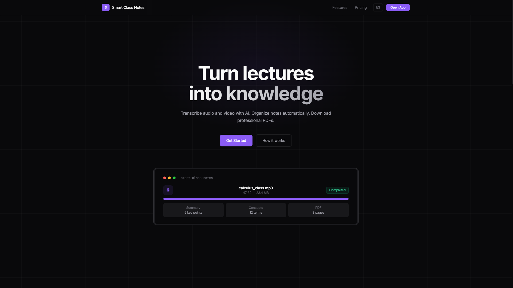
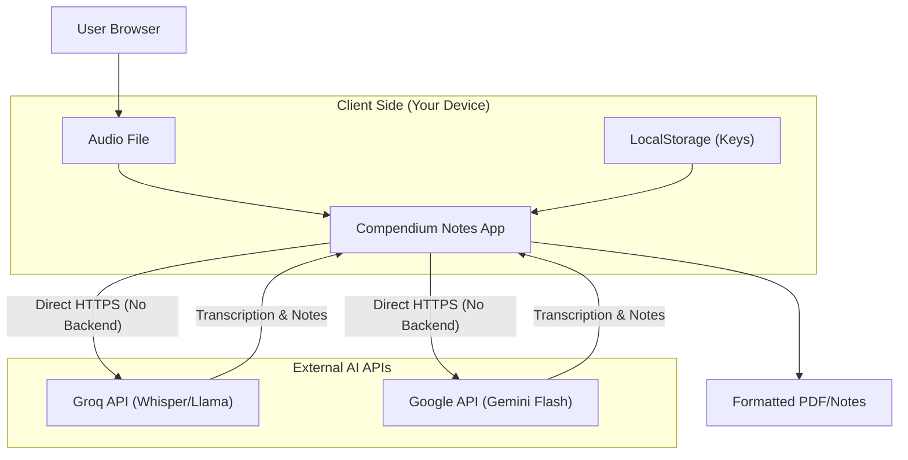

# Compendium Notes

[](https://opensource.org/licenses/MIT)
[](https://astro.build/)
[](https://reactjs.org/)
[](https://www.typescriptlang.org/)
[](https://tailwindcss.com/)

Elevate your notes using advanced AI models and BYOK security. A privacy-first application web that transforms audio recordings into structured academic notes and professional PDF edit-export capabilities. Built with **Astro**, **React**, and **TypeScript** for a blazing fast, zero-latency experience.

**BYOK Edition**: Bring Your Own Key. No subscriptions, no backend data storage, and 100% client-side processing for maximum privacy.



---

## 🌐 Live Demo

Try the application immediately: **[smart-class-notes.vercel.app](https://smart-class-notes.vercel.app/)**

The web application runs entirely in your browser using **client-side processing** (your audio and keys never touch a backend server).

**Security Note**:
- The web version is fully secure and safe to use with your API Keys.
- However, if you prefer maximum isolation or strict corporate compliance, you can run the application locally (`localhost`) using the installation steps below.

---

## ✨ Features

### Core Capabilities
- **Dual AI Engine** - Choose between **Groq** (Extreme Speed) and **Gemini** (Massive Context).
- **Audio Recorder** - Built-in recording functionality directly from your browser.
- **Privacy-First Architecture** - Keys and data stored exclusively in `localStorage`. Direct Browser-to-API communication.
- **Smart Transcription** - Uses **Whisper v3 Turbo** (via Groq) or **Gemini Flash 2.0** for lightning-fast audio-to-text.
- **AI-Powered Organization** - Automatically extracts summaries, concepts, and structured notes using **Llama 4 Scout** or **Gemini**.
- **Dark & Light Mode** - Full support for both themes with automatic system preference detection.
- **Premium PDF Styles** - Export in **Minimalist**, **Academic**, or **Cornell** styles.
- **Modern UX** - Floating Action Buttons, real-time focus indicators, and sleek mobile-responsive design.
- **Multi-Language** - Native support for **English** and **Spanish**.

### Technology Stack
- **Frontend**: Astro (Static Shell) + React (Interactive App)
- **Styling**: Vanilla CSS + Tailwind + Framer Motion
- **State Management**: Zustand
- **AI Integration**: Direct REST API calls to Groq & Google AI Studio

---

## ⚡ Model Benchmarks

Real-world processing performance for a 1-hour lecture (~50MB audio):

| Provider | Model | Speed | Cost (Free Tier) | Best For |
|----------|-------|-------|------------------|----------|
| **Groq** | Whisper v3 + Llama 4 Scout | ~15-30 seconds | Free | Extreme Speed |
| **Gemini** | Flash 2.0 | ~30-45 seconds | Free | Long Context (+1h) |

**Key Insights:**
- **Groq** (via Whisper) is unparalleled in speed for files under 100MB.
- **Gemini** offers a **1M+ token context window**, perfect for long seminars or multiple files.
- The **Cornell** template now uses premium geometric fonts (**Outfit**) for superior legibility in the preview.

---

## 🏗️ Architecture



---

## 🚀 Installation

### Prerequisites
- Node.js 18+
- NPM or PNPM

### Quick Start

1. Clone the repository:
   ```bash
   git clone https://github.com/ForcexDev/SmartClassNotes.git
   cd SmartClassNotes
   ```

2. Install dependencies:
   ```bash
   npm install
   ```

3. Launch the development server:
   ```bash
   npm run dev
   ```

4. Access the app at `http://localhost:4321`

---

## ⚙️ Configuration

No complex setup required. The application works out-of-the-box.

### API Keys
To use the application, you will need a free API Key from:
- **Groq**: [console.groq.com](https://console.groq.com)
- **Google Gemini**: [aistudio.google.com](https://aistudio.google.com)

Enter them in the application settings (gear icon).

---

## 📸 Use Cases

- **University Students** - Record lectures and instantly get Cornell-style study notes.
- **Professionals** - Transcribe meetings and generate executive summaries and action items.
- **Researchers** - Process interviews and oral histories into searchable text.
- **Content Creators** - Convert voice memos into blog posts or structured scripts.

---

## 🔧 Troubleshooting

### "API Key Invalid"
- Ensure your key has no extra spaces.
- Verify you have selected the correct provider matching your key.

### "Rate Limit Exceeded" / "Resource Exhausted"
- **Groq**: Free tier has strict per-minute limits. If you hit them, wait a minute or switch provider.
- **Gemini**: If you see "Limit 0" or 429 immediately, you likely need to link a **Billing Account** (credit card) in [Google AI Studio](https://aistudio.google.com/app/plan).
  - **Important**: The "Pay-as-you-go" plan often includes a massive **Free Tier** (or effectively **Unlimited** for Gemini Flash, as confirmed in testing) but requires identity verification.
  - Without billing, you are on a restricted "Free of Charge" tier which may be lower.

---

## 🤝 Contributing

Contributions are welcome! Please open an issue to discuss major changes before submitting a pull request.

1. Fork the Project
2. Create your Feature Branch (`git checkout -b feature/AmazingFeature`)
3. Commit your Changes (`git commit -m 'Add some AmazingFeature'`)
4. Push to the Branch (`git push origin feature/AmazingFeature`)
5. Open a Pull Request

---

## 📄 License

This project is licensed under the [MIT License](LICENSE).

---

**Developed by [ForcexDev](https://github.com/ForcexDev)**
