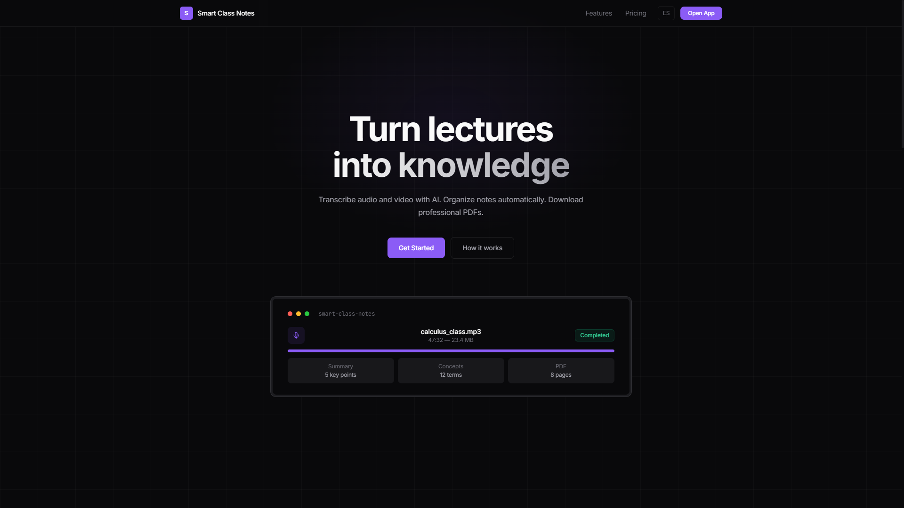
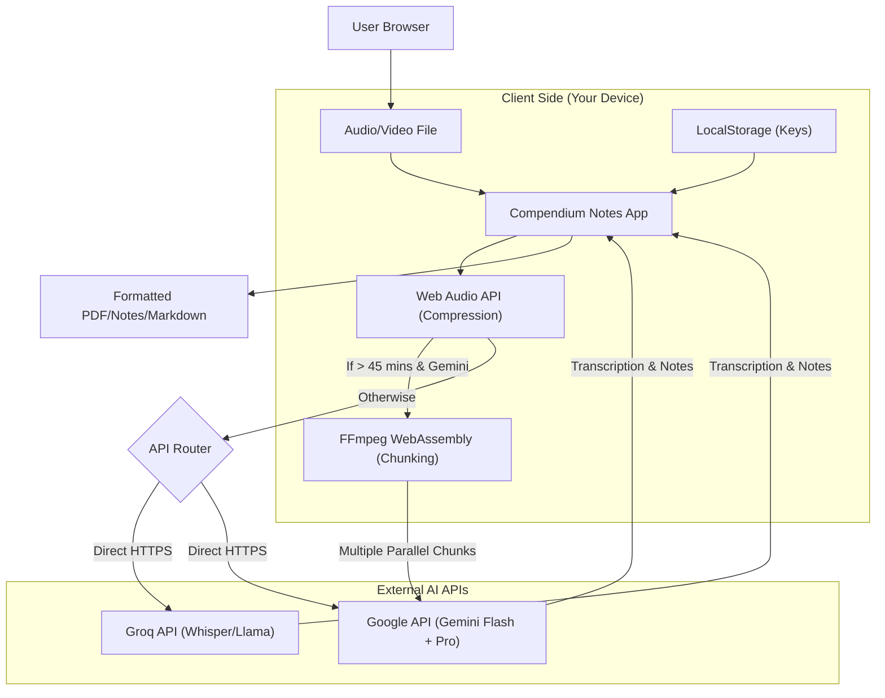

# Compendium Notes

[](https://opensource.org/licenses/MIT)
[](https://astro.build/)
[](https://reactjs.org/)
[](https://www.typescriptlang.org/)
[](https://tailwindcss.com/)

Elevate your notes using advanced AI models and BYOK security. A privacy-first web app that transforms audio recordings into structured academic notes and professional PDF edit-export capabilities. Built with **Astro**, **React**, and **TypeScript** for a blazing fast, zero-latency experience.

**BYOK Edition**: Bring Your Own Key. No subscriptions, no backend data storage, and 100% client-side processing for maximum privacy.



---

## 🌐 Live Demo

Try the application immediately: **[compendium-notes.vercel.app](https://compendium-notes.vercel.app/)**

The web application runs entirely in your browser using **client-side processing** (your audio and keys never touch a backend server).

**Security Note**:
- The web version is fully secure and safe to use with your API Keys.
- However, if you prefer maximum isolation or strict corporate compliance, you can run the application locally (`localhost`) using the installation steps below.

---

## ✨ Features

### Core Capabilities
- **100% Free & Unlimited** - No paywalls, no subscriptions. Bring your own free API keys and process as many hours as you need.
- **Dual AI Engine** - Choose between **Groq** (Extreme Speed) and **Gemini** (Massive Context & Multimodal).
- **Smart Audio Chunking** - Automatically splits long audio files (e.g., 2+ hour lectures) into optimal segments using FFmpeg, avoiding API timeouts and enabling infinite transcription length for Gemini.
- **Privacy-First Architecture** - Keys and data stored exclusively in `localStorage`. Direct Browser-to-API communication. Your data never touches our servers.
- **Intelligent Transcription** - Uses **Whisper v3 Turbo** (via Groq) or **Gemini Flash 2.0** for lightning-fast, highly accurate audio-to-text.
- **AI-Powered Organization** - Automatically extracts topics, key concepts, and generates structured **Markdown** notes using intelligent prompting.
- **Premium Export** - Download your structured notes directly into **Minimalist**, **Academic**, or **Cornell** PDF styles.
- **Built-in Audio Player** - Review your recordings while reading or editing the generated notes, with synchronized progress tracking.
- **Dark & Light Mode** - Full support for both themes with automatic system preference detection.
- **Multi-Language** - Native support for **English** and **Spanish**.

### Technology Stack
- **Frontend**: Astro (Static Shell) + React (Interactive App)
- **Styling**: Vanilla CSS + Tailwind + Framer Motion
- **State Management**: Zustand + Dexie.js (IndexedDB for persistent sessions)
- **Audio Processing**: Web Audio API + `@ffmpeg/ffmpeg` (WebAssembly)
- **AI Integration**: Direct REST API calls to Groq & Google AI Studio

---

## ⚡ Architecture Pipeline

Real-world processing performance for a 1-hour lecture (~50MB audio):

| Provider | Model | Speed | Cost | Best For |
|----------|-------|-------|------|----------|
| **Groq** | Whisper v3 + Llama 4 Scout | ~15-30 seconds | **Free** | Fast drafts & short meetings |
| **Gemini** | Flash 2.0 + Pro 2.5| ~30-45 seconds | **Free** | Long seminars, extreme accuracy |

**The Pipeline Flow:**
1. **Audio Compression**: Large files are automatically compressed locally using Web Audio API down to 16kHz mono (reducing 100MB files to ~10MB).
2. **Intelligent Chunking**: If using Gemini and the audio exceeds 45 minutes, it is seamlessly split into 30-minute chunks using FFmpeg WebAssembly.
3. **Parallel Transcription**: The chunks are sent directly from your browser to the AI provider.
4. **Markdown Organization**: The raw transcript is passed back to the AI to extract a title, format into Markdown sections, and summarize.
5. **Interactive Editor**: Review the transcript, edit the markdown, and export to PDF.

---

## 🏗️ Architecture


```mermaid
graph TD
    User["User Browser"]
    subgraph "Client Side (Your Device)"
        Upload["Audio/Video File"]
        Store["LocalStorage (Keys)"]
        App["Compendium Notes App"]
        AudioAPI["Web Audio API (Compression)"]
        FFmpeg["FFmpeg WebAssembly (Chunking)"]
    end
    
    subgraph "External AI APIs"
        Groq["Groq API (Whisper/Llama)"]
        Gemini["Google API (Gemini Flash + Pro)"]
    end

    User --> Upload
    Upload --> App
    Store --> App
    
    App --> AudioAPI
    AudioAPI -- "If > 45 mins & Gemini" --> FFmpeg
    AudioAPI -- "Otherwise" --> APIs
    FFmpeg -- "Multiple Parallel Chunks" --> Gemini
    
    APIs{"API Router"}
    APIs -- "Direct HTTPS" --> Groq
    APIs -- "Direct HTTPS" --> Gemini
    
    Groq -- "Transcription & Notes" --> App
    Gemini -- "Transcription & Notes" --> App
    
    App --> Result["Formatted PDF/Notes/Markdown"]
```

---

## 🚀 Installation

### Prerequisites
- Node.js 18+
- NPM or PNPM

### Quick Start

1. Clone the repository:
   ```bash
   git clone https://github.com/ForcexDev/compendium-notes.git
   cd compendium-notes
   ```

2. Install dependencies:
   ```bash
   npm install
   ```

3. Launch the development server:
   ```bash
   npm run dev
   ```

4. Access the app at `http://localhost:4321`

---

## ⚙️ Configuration

No complex setup required. The application works out-of-the-box.

### API Keys
To use the application, you will need a free API Key from:
- **Groq**: [console.groq.com](https://console.groq.com)
- **Google Gemini**: [aistudio.google.com](https://aistudio.google.com)

Enter them in the application settings (gear icon).

---

## 📸 Use Cases

- **University Students** - Record lectures and instantly get Cornell-style study notes.
- **Professionals** - Transcribe meetings and generate executive summaries and action items.
- **Researchers** - Process interviews and oral histories into searchable text.
- **Content Creators** - Convert voice memos into blog posts or structured scripts.

---

## 🔧 Troubleshooting

### "API Key Invalid"
- Ensure your key has no extra spaces.
- Verify you have selected the correct provider matching your key.

### "Rate Limit Exceeded" / "Resource Exhausted"
- **Groq**: Free tier has strict per-minute limits. If you hit them, wait a minute or switch provider.
- **Gemini**: If you see "Limit 0" or 429 immediately, you likely need to link a **Billing Account** (credit card) in [Google AI Studio](https://aistudio.google.com/app/plan).
  - **Important**: The "Pay-as-you-go" plan often includes a massive **Free Tier** (or effectively **Unlimited** for Gemini Flash 2.0, as confirmed in testing) but requires identity verification.
  - Without billing, you are on a restricted "Free of Charge" tier which may be lower.

---

## 🤝 Contributing

Contributions are welcome! Please open an issue to discuss major changes before submitting a pull request.

1. Fork the Project
2. Create your Feature Branch (`git checkout -b feature/AmazingFeature`)
3. Commit your Changes (`git commit -m 'Add some AmazingFeature'`)
4. Push to the Branch (`git push origin feature/AmazingFeature`)
5. Open a Pull Request

---

## 📄 License

This project is licensed under the [MIT License](LICENSE).

---

**Developed by [ForcexDev](https://github.com/ForcexDev)**
